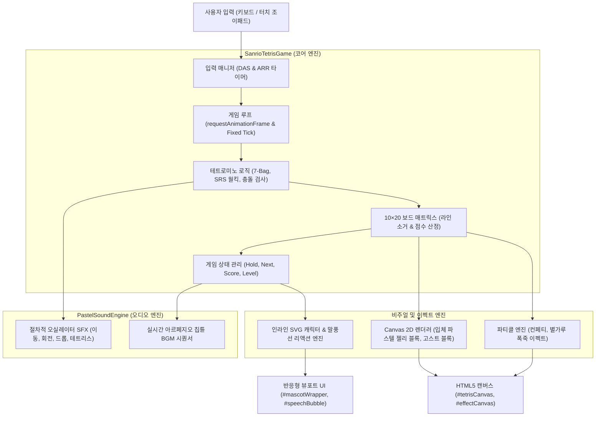

# 🎀 Sanrio & Snoopy Pastel Tetris - 시스템 아키텍처 및 상세 기술 설계 문서

> **문서 버전**: v1.0.0  
> **최종 수정일**: 2026-10-04  
> **프로젝트 저장소**: [https://github.com/newbieski/sanrio-tetris](https://github.com/newbieski/sanrio-tetris)  
> **라이브 데모**: [https://newbieski.github.io/sanrio-tetris/](https://newbieski.github.io/sanrio-tetris/)  

---

## 1. 아키텍처 개요 및 설계 철학 (Architecture Overview)

본 프로젝트는 고전 아케이드 테트리스(Tetris)의 공식 물리 가이드라인을 철저히 준수하면서, 산리오(Sanrio) 프렌즈 및 스누피(Snoopy & Peanuts)의 아기자기한 감성을 융합한 **현대적 웹 기반 테트리스 게임 엔진**입니다.

### 🌟 핵심 설계 원칙 (Core Principles)
1. **Zero-Dependency & No-Build (무의존성 / 빌드리스)**:
   * React, Vue, Three.js, Pixi.js, Webpack, Babel 등의 외부 프레임워크나 번들러 없이 **순수 HTML5 Canvas 2D + Vanilla JavaScript + CSS3**만으로 구축되었습니다.
   * 저장소의 파일 구조가 그대로 브라우저에서 실행 가능한 완제품 형태를 가집니다.
2. **100% Client-Side Pure Web Standard (완전한 클라이언트 사이드 실행)**:
   * 백엔드 API 서버나 DB 없이, 모든 물리 연산, 충돌 감지, 사운드 합성, 파티클 폭죽 효과가 **접속자의 브라우저 V8 엔진 및 GPU 가속**으로 실시간 60 FPS 처리됩니다.
3. **Zero-Asset Vector Art (무에셋 벡터 그래픽)**:
   * 외부 이미지 파일(PNG, JPG) 없이 모든 7개 캐릭터가 **코드 내장형 인라인 벡터 SVG**로 렌더링되어 로딩 지연(0ms)과 네트워크 비용 0원을 달성합니다.
4. **Procedural Web Audio Synth (절차적 사운드 신디사이저)**:
   * 외장 MP3/WAV 파일 의존 없이, Web Audio API 오실레이터(Oscillator)를 사용하여 칩튠 SFX 및 배경음악을 코드 레벨에서 실시간 합성합니다.
5. **Mobile-First Dynamic Viewport Fit (`100dvh` 무스크롤 핏)**:
   * 스마트폰, 아이패드, PC 등 어떤 디스플레이에서도 스크롤 없이 보드와 컨트롤 패드가 한 화면에 일체형으로 배치되는 반응형 엔진을 탑재했습니다.

---

## 2. 시스템 아키텍처 다이어그램 (System Architecture)



---

## 3. 테트리스 코어 물리 및 수학 모델 (Tetris Physics & Logic)

공식 **Tetris Guideline** 규격을 완벽하게 충족하는 알고리즘을 자바스크립트로 직접 구현하였습니다.

### 3.1 보드 매트릭스 좌표계
* **규격**: $10 \text{ cols} \times 20 \text{ rows}$ (내부 캔버스 해상도: $300\text{px} \times 600\text{px}$, 단일 블록 크기: $30\text{px}$).
* **매트릭스 표현**:
  ```javascript
  this.board = Array.from({ length: 20 }, () => Array(10).fill(0));
  ```
  `0`은 빈 공간이며, `1~7`은 테트로미노 종류 및 고유 색상 인덱스를 나타냅니다.

---

### 3.2 공식 7-Bag 무작위 생성기 (7-Bag Randomizer)
동일한 블록이 3~4번 연속 나오는 억울한 상황을 방지하고 공정한 확률을 보장하기 위해, 7가지 테트로미노(I, J, L, O, S, T, Z)를 한 주머니(Bag)에 넣고 셔플(Fisher-Yates)하여 순차 배출하는 방식을 사용합니다:

```javascript
generateBag() {
  const pieces = ['I', 'J', 'L', 'O', 'S', 'T', 'Z'];
  for (let i = pieces.length - 1; i > 0; i--) {
    const j = Math.floor(Math.random() * (i + 1));
    [pieces[i], pieces[j]] = [pieces[j], pieces[i]];
  }
  return pieces;
}
```

---

### 3.3 Super Rotation System (SRS) 및 월킥(Wall Kick)
벽이나 기존 바닥 블록에 가로막혀 회전이 불가능한 상황에서, 조각을 좌우/상하로 밀어내어 회전을 성립시키는 **SRS 월킥 오프셋 테이블**을 완벽 구현하였습니다.

```
[SRS 회전 전이 상태]
State 0 (기본) ⇄ State 1 (시계방향 90°) ⇄ State 2 (180°) ⇄ State 3 (270°)
```

* **J, L, S, T, Z 조각의 5단계 월킥 테스트 테이블**:
  회전 시도시 기본 위치가 겹치면 아래 5개 오프셋을 순서대로 테스트하여 가장 먼저 유효한 위치로 스냅합니다:
  ```javascript
  const JLSTZ_KICKS = {
    '0->1': [[0,0], [-1,0], [-1,1], [0,-2], [-1,-2]],
    '1->0': [[0,0], [1,0], [1,-1], [0,2], [1,2]],
    '1->2': [[0,0], [1,0], [1,-1], [0,2], [1,2]],
    '2->1': [[0,0], [-1,0], [-1,1], [0,-2], [-1,-2]],
    '2->3': [[0,0], [1,0], [1,1], [0,-2], [1,-2]],
    '3->2': [[0,0], [-1,0], [-1,-1], [0,2], [-1,2]],
    '3->0': [[0,0], [-1,0], [-1,-1], [0,2], [-1,2]],
    '0->3': [[0,0], [1,0], [1,1], [0,-2], [1,-2]]
  };
  ```
* **I 조각 (긴 막대)**: 중심축이 격자 모서리에 위치하므로 전용 $4\times4$ 바운딩 박스 오프셋 테이블을 분리 적용.

---

### 3.4 고스트 블록 (Ghost Block) 실시간 투영
플레이어가 블록을 하드 드롭하기 전, 바닥 착지 지점을 투명한 반투명 음영으로 미리 보여주는 실시간 광선 투과(Ray-casting) 알고리즘:

```javascript
getGhostPosition() {
  let ghostY = this.currentPos.y;
  while (this.isValidMove(this.currentPiece, { x: this.currentPos.x, y: ghostY + 1 }, this.board)) {
    ghostY++;
  }
  return { x: this.currentPos.x, y: ghostY };
}
```

---

### 3.5 점수 체계 및 레벨 가속 공식 (Scoring Engine)
라인 클리어 수와 연속 콤보(Combo)에 따라 지수적으로 점수가 증가하며, 원작 닌텐도/세가 가이드라인 공식을 계승합니다:

$$\text{Single (1줄)} = 100 \times \text{Level}$$
$$\text{Double (2줄)} = 300 \times \text{Level}$$
$$\text{Triple (3줄)} = 500 \times \text{Level}$$
$$\text{Tetris (4줄)} = 800 \times \text{Level} \quad (\text{Back-to-Back 시 } 1.5\text{배 보너스})$$
$$\text{Combo Bonus} = 50 \times \text{Combo Count} \times \text{Level}$$

* **낙하 속도(Drop Interval)**: 레벨 $L$에 따라 등비급수적으로 단축:
  $$\text{Interval}(L) = \max\left(50\text{ms}, \left(0.8 - (L - 1) \times 0.007\right)^{L - 1} \times 1000\text{ms}\right)$$

---

## 4. 인라인 벡터 SVG 캐릭터 & 리액션 시스템

외부 이미지 로딩에 따른 깜빡임과 트래픽을 방지하기 위해, 캐릭터 디자인을 순수 **SVG Path / Circle / Ellipse 벡터 수학 공식**으로 `game.js` 내에 직접 하드코딩했습니다.

| 캐릭터 ID | 대표 컬러 | 상징 오브젝트 | 축하 리액션 예시 |
| :--- | :---: | :---: | :--- |
| **snoopy** (스누피) | `#E83D56` | 빨간 개집, 뼈다귀 🐾 | *"🐾 멍멍! 스누피의 환상적인 테트리스 댄스~"* |
| **purin** (폼폼푸린) | `#FFF176` | 갈색 베레모, 커스터드 푸딩 🍮 | *"🎉 와아아! 푸딩 대축제 테트리스!! 🍮✨"* |
| **kitty** (헬로키티) | `#FF85A2` | 빨간 리본, 사과 🎀 | *"✨ 판타스틱 테트리스! 리본 파티! 🎀🎉"* |
| **cinnamoroll** (시나모롤) | `#7ED6F7` | 펄럭이는 큰 귀, 시나몬 롤 ☁️ | *"☁️ 기적의 시나모롤 테트리스 만세! 🩵🎉"* |
| **kuromi** (쿠로미) | `#C38FFF` | 블랙 조커 두건, 핑크 해골 💜 | *"🖤 앗싸! 쿠로미 님 전설의 테트리스 강림! 😈"* |
| **melody** (마이멜로디) | `#FFB3C6` | 핑크 레이스 후드, 꽃핀 🌸 | *"🌸 와아~ 멜로디 너무너무 기뻐! 멜로디 테트리스! 💕"* |
| **pochacco** (포차코) | `#80E27E` | 검은 귀 바나나 아이스크림 🍀 | *"⚡ 전속력 질주! 포차코 슈퍼 테트리스 성공! 🐶"* |

* **라인 클리어 리액션 트리거**: 라인을 지울 때마다 캐릭터가 통통 튀는 바운스 애니메이션(`popBounce`)을 수행하며, 클리어 등급에 맞는 고유 말풍선 대사가 2.5초간 노출됩니다.

---

## 5. Web Audio API 절차적 사운드 신디사이저 (PastelSoundEngine)

외장 오디오 파일의 용량 부담과 모바일 자동재생 차단(Autoplay Policy) 문제를 원천 차단하기 위해, **Web Audio API 오실레이터 주파수 합성**을 사용합니다.

### 5.1 사운드 이펙트(SFX) 주파수 디자인
* **블록 회전 (playRotate)**: 경쾌한 2화음 상행 사인파 (520Hz ➡️ 680Hz, 80ms)
* **소프트 드롭 (playMove)**: 부드러운 탭 톤 (420Hz, 60ms)
* **하드 드롭 (playDrop)**: 무게감 있는 트라이앵글 타격파 (180Hz, 150ms)
* **라인 클리어 팡파르 (playLineClear)**: 메이저 펜타토닉 음계 아르페지오
  * 1줄: C5 (523Hz) ➡️ E5 (659Hz)
  * 2줄: C5 ➡️ E5 ➡️ G5 (784Hz)
  * 3줄: C5 ➡️ E5 ➡️ G5 ➡️ C6 (1046Hz)
  * **4줄 (Tetris)**: C5 ➡️ E5 ➡️ G5 ➡️ C6 ➡️ E6 (1318Hz) ➡️ G6 (1568Hz) 장조 화음 글리산도

### 5.2 절차적 칩튠 BGM 시퀀서
별도 BGM 스트리밍 파일 없이, `playProceduralBgmNote()`가 백그라운드 타이머에 맞춰 감미로운 C-Major / F-Major 파스텔 멜로디 루프를 무한 재생합니다.

---

## 6. 모바일 반응형 뷰포트 레이아웃 (`100dvh` Docked Keypad)

스마트폰 모바일 브라우저 접속 시 발생하는 **"화면-키패드 분리 및 상하 스크롤 문제"**를 해결한 반응형 아키텍처입니다.

```
+-------------------------------------------------------------+
| [🎀 산리오 테트리스 ⭐] (Compact Header)                      |
+-------------------------------------------------------------+
| [HOLD (C)]   |       [ 10 x 20 TETRIS BOARD ]       | [NEXT] |
| (미니 캔버스) |                                      | [SCORE]|
|              |     aspect-ratio: 1 / 2;             | [LEVEL]|
| [마스코트]   |     height: min(44vh, 340px);        | [LINES]|
| (38px SVG)   |     자동 반응형 축소                   |        |
+-------------------------------------------------------------+
|              [ DOCKED MOBILE CONTROLLER ZONE ]              |
|                                                             |
|   (Left Thumb Zone)                  (Right Thumb Zone)     |
|   ┌─────────────┐                    ┌─────────────────┐    |
|   │     [▲]     │                    │     [HOLD]      │    |
|   │ [◀] 🐾  [▶] │                    │   [DROP]        │    |
|   │     [▼]     │                    │        [ROTATE] │    |
|   └─────────────┘                    └─────────────────┘    |
+-------------------------------------------------------------+
```

### 6.1 핵심 CSS 기법
1. **`height: 100dvh` (Dynamic Viewport Height)**:
   * 모바일 사파리/크롬의 동적 주소창 확축에 유연하게 대응하여 `overflow: hidden; touch-action: none;`으로 스크롤을 원천 차단.
2. **보드 자동 비율 축소 (`aspect-ratio: 1 / 2`)**:
   * 고정 높이 600px를 제거하고, 화면 높이에 비례하여 가변 축소되도록 설계하여 컨트롤 패드 공간을 항상 보장.
3. **엄지손가락 인체공학적 도킹 (Ergonomic Docking)**:
   * **왼손**: 110px D-Pad (좌/우/하강) 및 스누피 발자국 조이스틱 🐾.
   * **오른손**: 60px 대형 회전 버튼(`↻`), 하드 드롭(`⚡`), 홀드(`🔄`)가 엄지 반경에 맞춘 곡선형 클러스터 배치.
4. **가로 모드 (Landscape) 콘솔 모드**:
   * 스마트폰을 가로로 돌리면 중앙에 보드가 오고 좌우에 컨트롤러가 배치되는 닌텐도 스위치형 인터페이스로 자동 전환.

---

## 7. 정적 배포 및 캐시 무효화 전략 (Deployment & Cache-Busting)

### 7.1 GitHub Pages 1:1 매핑 구조
저장소의 루트 파일이 그대로 웹 호스팅 주소로 노출됩니다:
* `index.html` ➡️ `https://newbieski.github.io/sanrio-tetris/`
* `style.css` ➡️ `https://newbieski.github.io/sanrio-tetris/style.css`
* `game.js` ➡️ `https://newbieski.github.io/sanrio-tetris/game.js`

### 7.2 캐시 버스팅 (Cache-Busting) 규격
모바일 브라우저의 강력한 정적 파일 캐시로 인해 구버전이 노출되는 문제를 방지하기 위해 파일 주소에 버전 쿼리를 강제 적용합니다:

```html
<meta http-equiv="Cache-Control" content="no-cache, no-store, must-revalidate">
<link rel="stylesheet" href="style.css?v=2.0.0">
<script src="game.js?v=2.0.0"></script>
```

---

## 8. 파일 구조 (Repository Layout)

```
/Users/taehun/sanrio-tetris
├── index.html                   # 메인 마크업, 캔버스 구조, 오버레이, 키패드 DOM
├── style.css                    # 파스텔 디자인 시스템, 100dvh 반응형 뷰포트 레이아웃
├── game.js                      # 테트리스 코어 물리, SVG 데이터, Web Audio 신디사이저
├── README.md                    # 프로젝트 가이드, 조작법, 라이브 배포 링크
└── docs/
     └── architecture_and_design.md  # [본 문서] 시스템 아키텍처 및 상세 기술 설계서
```
